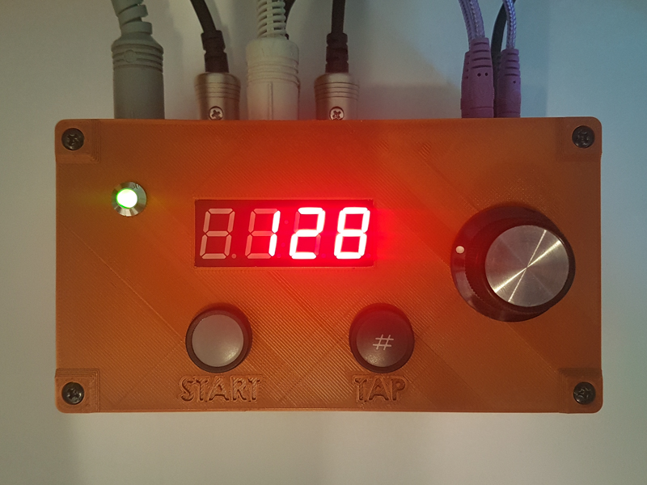
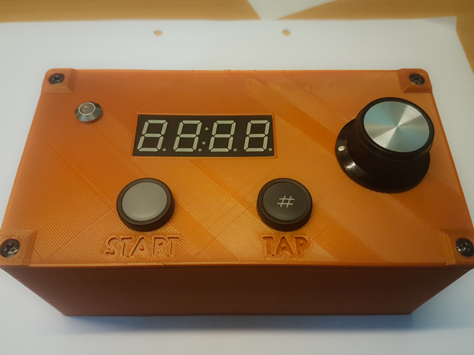
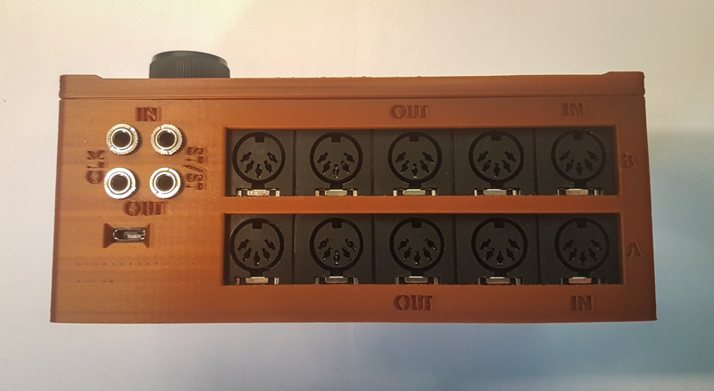
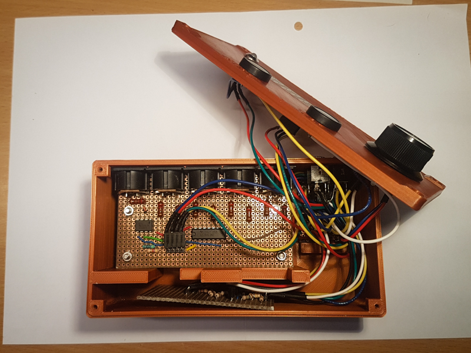
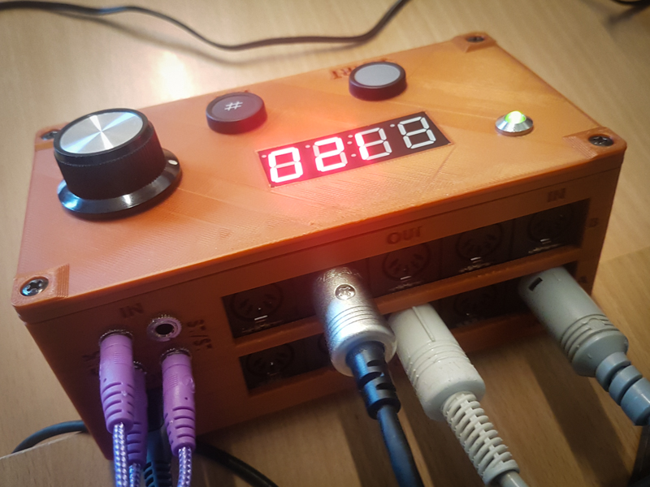

# MIDI Central
Microcontroller based device to centralize MIDI messages.

## Features
### Software
- Arduino based code
- Merges up to 3 different MIDI inputs
- MIDI to CV clock converter and vice versa
- Act as a MIDI device when plugged in a computer

### Hardware
- 2x MIDI inputs
- 8x MIDI outputs
- 1x CV clock input and output
- 1x CV start/stop input and output
- 1x start/stop button
- 1x tap button
- 1x encoder
- 1x 4-Digit 7-Segment Display
- Teensy 3.2 (32 bit ARM Cortex-M4 72 MHz CPU)
- USB powered
